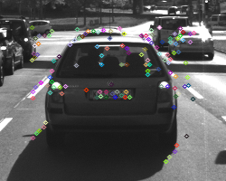
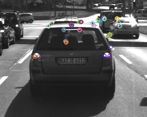
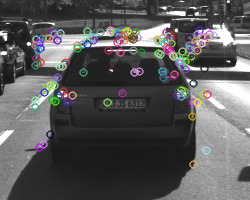
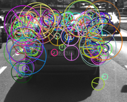
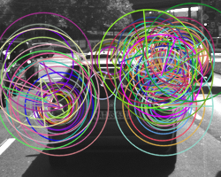
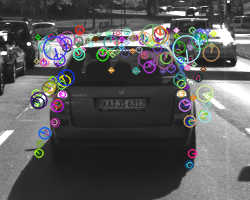
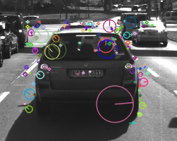
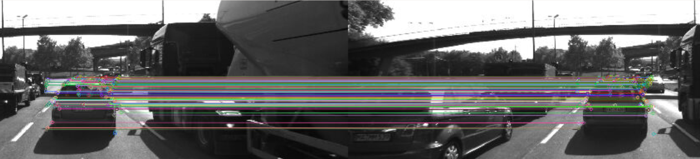
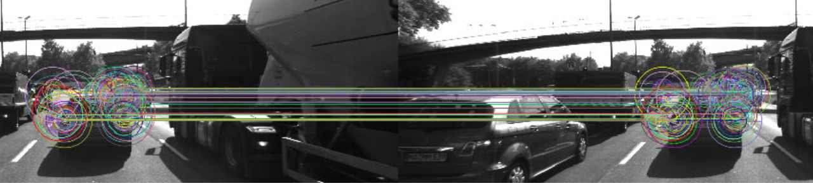

# SFND 2D Feature Tracking

## Overview

In the  mid-term project, I built the feature tracking part and test various detector / descriptor combinations to see which ones perform best. The idea is to  build a collision system - that's the overall goal for Final Project. My codes consist of four parts:

* First, I focused on loading images, setting up data structures and putting everything into a ring buffer to optimize memory load. (**lines 45-69 in MidTermProject_Camera_Student.cpp**)
* Then, I integrated several keypoint detectors such as HARRIS, FAST, BRISK and SIFT and compare them with regard to number of keypoints and speed. (**lines 77-97 in MidTermProject_Camera_Student.cpp**)
* In the next part, I then focused on descriptor extraction and matching using brute force and also the FLANN approach (**lines 104-197 in MidTermProject_Camera_Student.cpp**)
* In the last part, once the code framework is complete, I tested the various algorithms in different combinations and compare them with regard to some performance measures. 

## Performance Measurements

### 1. Number of Keypoints 

I count the number of keypoints **on the preceding vehicle** for all 10 images and take note of the distribution of their neighborhood size. I tried to tune the parameters so that every detector can detect almost the same amount of keypoints. From the table below, the Harris gives a big different for all 10 images such as 2611 keypoints on img5 , but 200 keypoints on img6.  That is the reason Harris detector is not sensitive to brightness change, but the value of `minResponse` will affect the results. 

|      | Detector            | Shi-Tomasi | Harris | FAST | BRISK | ORB  | AKAZE | SIFT |
| :--: | :------------------ | :--------: | :----: | :--: | :---: | :--: | :---: | :--: |
| img0 | #keypoints          |    1370    |  339   | 1431 | 1418  | 1350 | 1352  | 1438 |
|      | #Filtered keypoints |    125     |   51   | 123  |  167  | 215  |  166  | 138  |
| img1 | #keypoints          |    1301    |  286   | 1422 | 1394  | 1350 | 1327  | 1371 |
|      | #Filtered keypoints |    118     |   41   | 123  |  174  | 220  |  157  | 132  |
| img2 | #keypoints          |    1361    |  349   | 1399 | 1387  | 1350 | 1311  | 1380 |
|      | #Filtered keypoints |    123     |   63   | 129  |  166  | 235  |  161  | 124  |
| img3 | #keypoints          |    1358    |  356   | 1409 | 1369  | 1350 | 1351  | 1335 |
|      | #Filtered keypoints |    120     |   58   | 126  |  166  | 255  |  155  | 137  |
| img4 | #keypoints          |    1333    |  521   | 1372 | 1331  | 1350 | 1360  | 1304 |
|      | #Filtered keypoints |    120     |   85   | 121  |  165  | 253  |  163  | 134  |
| img5 | #keypoints          |    1284    |  2611  | 1377 | 1280  | 1350 | 1347  | 1369 |
|      | #Filtered keypoints |    113     |  322   | 125  |  163  | 271  |  164  | 140  |
| img6 | #keypoints          |    1322    |  200   | 1387 | 1316  | 1350 | 1363  | 1396 |
|      | #Filtered keypoints |    114     |   38   | 118  |  166  | 270  |  173  | 137  |
| img7 | #keypoints          |    1366    |  806   | 1316 | 1313  | 1350 | 1331  | 1382 |
|      | #Filtered keypoints |    123     |  136   | 118  |  158  | 268  |  175  | 148  |
| img8 | #keypoints          |    1389    |  572   | 1331 | 1251  | 1350 | 1357  | 1462 |
|      | #Filtered keypoints |    111     |   96   | 119  |  160  | 270  |  177  | 159  |
| img9 | #keypoints          |    1339    |  1471  | 1336 | 1286  | 1350 | 1331  | 1422 |
|      | #Filtered keypoints |    112     |  194   | 107  |  147  | 262  |  179  | 137  |

###  2. Distribution of keypoints

The keypoints from SHITOMASI, HARRIS and FAST  only have (x, y) position information,  whereas from BRISK, ORB, AKAZE and SIFT include position, orientation and scale such as (x, y, σ, θ). 

<table style="width:100%">
  <tr>
    <th>
      

           
            SHITOMASI
      

    </th>
        <th>

           
            HARRIS
        

    </th>
       <th>

           
            FAST
        

    </th>
  </tr>
  <tr>
    <th>

           
            BRISK
        

    </th>
        <th>

           
            ORB
        

    </th>
    <th>

           
            AKAZE
        

    </th>
  </tr>
  <tr>
    <th>

           
            SIFT
        

 </tr>
</table>  

### 3. Number of Matched Keypoints 

I count the number of matched keypoints for all 10 images using all possible combinations of detectors and descriptors. In the matching step, use the BF approach with the descriptor distance ratio set to 0.8. 

The detectors equal to  `{"SHITOMASI", "HARRIS","FAST", "BRISK", "ORB", "AKAZE", "SIFT"}`,  and the descriptors equal to  `{"BRISK", "BRIEF", "ORB", "FREAK", "AKAZE", "SIFT"}`. As a result, there are  42 combinations, but [AKAZE](https://docs.opencv.org/master/d8/d30/classcv_1_1AKAZE.html) descriptors can only be used with KAZE or AKAZE keypoints and I have not find a method to solve the problem of insufficient memory on the combination of SIFT/ORB. At last, I made a statistics on **35** combinations of detectors and descriptors as being showed on the below table.

* **#Keypoints**: the average number of detected keypoints for all 10 images;
* **T_detector**: the average time of detecting  keypoints on all 10 images;
* **T_descriptor**:  the average time of making descriptors on preceding vehicle for all 10 images;
* **#Matches**:  the average number  of matches between two frames for all 10 images;
* **T_match**:  the average time of matching descriptors on preceding vehicle for all 10 images;
* **T_total**: T_detector + T_descriptor + T_match.

| Detector/Descriptor | #Keypoints | T_detector(ms) | #Filtered   Keypoints | T_descriptor(ms) | #Matches | T_match(ms) | T_total(ms) |
| ------------------- | :--------: | :------------: | :-------------------: | :--------------: | :------: | :---------: | :---------: |
| Shi-Tomasi/BRISK    |    1342    |     14.66      |          118          |      1.6220      |    85    |   0.1849    |   16.4669   |
| Shi-Tomasi/BRIEF    |    1342    |     14.25      |          118          |      0.8488      |   104    |   0.1539    |   15.2527   |
| Shi-Tomasi/ORB      |    1342    |     14.00      |          118          |      3.9557      |   100    |   0.1430    |   18.0987   |
| Shi-Tomasi/FREAK    |    1342    |     14.01      |          118          |     27.3569      |    85    |   0.1606    |   41.5275   |
| Shi-Tomasi/SIFT     |    1342    |     14.62      |          118          |     16.5781      |   103    |   0.1975    |   31.3956   |
| Harris/BRISK        |    751     |     25.25      |          108          |      1.4416      |    41    |   0.1450    |   26.8366   |
| Harris/BRIEF        |    751     |     25.39      |          108          |      0.8963      |    45    |   0.1761    |   26.4624   |
| Harris/ORB          |    751     |     24.66      |          108          |      3.8412      |    44    |   0.1661    |   28.6673   |
| Harris/FREAK        |    751     |     24.84      |          108          |     26.9284      |    47    |   0.1327    |   51.9011   |
| Harris/SIFT         |    751     |     25.23      |          108          |     16.5915      |    34    |   0.1765    |   41.9980   |
| FAST/BRISK          |    1378    |     1.2423     |          120          |      1.5295      |    84    |   0.1850    |   2.9568    |
| FAST/BRIEF          |    1378    |     1.1003     |          120          |      0.7815      |   101    |   0.1665    |   2.0483    |
| FAST/ORB            |    1378    |     1.1130     |          120          |      3.8113      |   101    |   0.2113    |   5.1356    |
| FAST/FREAK          |    1378    |     1.1252     |          120          |     26.6651      |    81    |   0.1745    |   27.9648   |
| FAST/SIFT           |    1378    |     1.0489     |          120          |     17.1654      |    96    |   0.2351    |   18.4494   |
| BRISK/BRISK         |    1334    |     17.956     |          163          |      1.9231      |   110    |   0.2641    |   20.1432   |
| BRISK/BRIEF         |    1334    |    18.3098     |          163          |      0.9064      |   114    |   0.2204    |   19.4366   |
| BRISK/ORB           |    1334    |    18.2716     |          163          |     11.8685      |   107    |   0.2238    |   30.3639   |
| BRISK/FREAK         |    1334    |    17.9881     |          163          |     27.1878      |   108    |   0.2241    |   45.4000   |
| BRISK/SIFT          |    1334    |    17.9528     |          163          |     27.3908      |   116    |   0.6610    |   46.0046   |
| ORB/BRISK           |    1350    |     8.2537     |          251          |      2.6278      |   176    |   0.4605    |   11.3420   |
| ORB/BRIEF           |    1350    |     8.6526     |          251          |      1.0994      |   125    |   0.4716    |   10.2236   |
| ORB/ORB             |    1350    |     7.6809     |          251          |     13.0181      |   179    |   0.4762    |   21.1752   |
| ORB/FREAK           |    1350    |     8.8293     |          251          |     26.8927      |   100    |   0.2021    |   35.9241   |
| ORB/SIFT            |    1350    |     8.3815     |          251          |     56.7078      |   177    |   0.7164    |   65.8057   |
| AKAZE/BRISK         |    1342    |    56.7118     |          167          |      1.8993      |   135    |   0.2975    |   58.9086   |
| AKAZE/BRIEF         |    1342    |    56.2656     |          167          |      0.8353      |   140    |   0.2451    |   57.3460   |
| AKAZE/ORB           |    1342    |     56.36      |          167          |      8.5920      |   131    |   0.2893    |   65.2413   |
| AKAZE/FREAK         |    1342    |    58.4053     |          167          |     26.5519      |   131    |   0.2899    |   85.2471   |
| AKAZE/AKAZE         |    1342    |    57.6504     |          167          |     51.0390      |   139    |   0.3075    |  108.9969   |
| AKAZE/SIFT          |    1342    |    57.7133     |          167          |     20.6419      |   141    |   0.3958    |   78.7510   |
| SIFT/BRISK          |    1385    |    100.8103    |          138          |      1.6478      |    65    |   0.2384    |  102.6965   |
| SIFT/BRIEF          |    1385    |    101.4355    |          138          |      0.7471      |    78    |   0.1937    |  102.3763   |
| SIFT/FREAK          |    1385    |    100.6271    |          138          |     26.7568      |    65    |   0.3156    |  127.6995   |
| SIFT/SIFT           |    1385    |    93.9212     |          138          |     64.4365      |    88    |   0.2535    |  158.6112   |

| Descriptor                              |  BRISK   |  BRIEF   |   ORB    |  AKAZE   |   SIFT    |
| --------------------------------------- | :------: | :------: | :------: | :------: | :-------: |
| size()                                  | [64x215] | [32x198] | [32x215] | [61x166] | [128x166] |
| Memory(bytes) for every item descriptor |    64    |    32    |    32    |    61    |    128    |

In computing TTC on camera, we have to estimate the mean or median of all distance ratio between matched keypoints between two frames. So Matches and total time are the key indicators to find the appropriate combinations  with no ROC.  Besides, I think we should consider the descriptor memory.  You can **sort the table** if you follow the [page](https://github.com/Mottie/GitHub-userscripts/wiki/GitHub-sort-content). 

## Top Three combinations

| Detector/Descriptor | #Matches | T_total(ms) | Memory(bytes)   for every item descriptor |                                 |
| :-----------------: | :------: | :---------: | :---------------------------------------: | ------------------------------- |
|     FAST/BRIEF      |   101    |   2.0483    |                    32                     | Fastest                         |
|      ORB/BRIEF      |   125    |   10.2236   |                    32                     |                                 |
|      ORB/BRISK      |   176    |   11.342    |                    64                     | Most accurate but   more memory |

FAST/BRIEF combination is the fastest with least memory for the same items of descriptors,  whereas  ORB/BRISK may be the most accurate with the most matches.  But, for more accurate comparisons, ROC is needed.

## Results

##### FAST/BRIEF

##### ORB/BRIEF

##### ORB/BRISK

## Dependencies for Running Locally
* cmake >= 2.8
  * All OSes: [click here for installation instructions](https://cmake.org/install/)
* make >= 4.1 (Linux, Mac), 3.81 (Windows)
  * Linux: make is installed by default on most Linux distros
  * Mac: [install Xcode command line tools to get make](https://developer.apple.com/xcode/features/)
  * Windows: [Click here for installation instructions](http://gnuwin32.sourceforge.net/packages/make.htm)
* OpenCV >= 4.1
  * This must be compiled from source using the `-D OPENCV_ENABLE_NONFREE=ON` cmake flag for testing the SIFT and SURF detectors.
  * The OpenCV 4.1.0 source code can be found [here](https://github.com/opencv/opencv/tree/4.1.0)
* gcc/g++ >= 5.4
  * Linux: gcc / g++ is installed by default on most Linux distros
  * Mac: same deal as make - [install Xcode command line tools](https://developer.apple.com/xcode/features/)
  * Windows: recommend using [MinGW](http://www.mingw.org/)

## Basic Build Instructions

1. Clone this repo.
2. Make a build directory in the top level directory: `mkdir build && cd build`
3. Compile: `cmake .. && make`
4. Run it: `./2D_feature_tracking`.